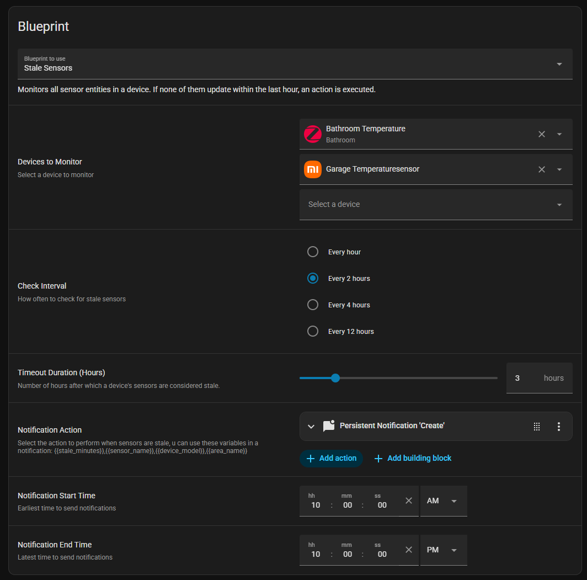

# home-assistant-blueprints
This repository contains my custom [Home Assistant](https://www.home-assistant.io) blueprints.

---

## 📘 Available Blueprints

### Detect stale sensors
When a sensor is not updated in x-hours an action can be run (for example, send a notification)

---
# Example Automations

## Example Notification

